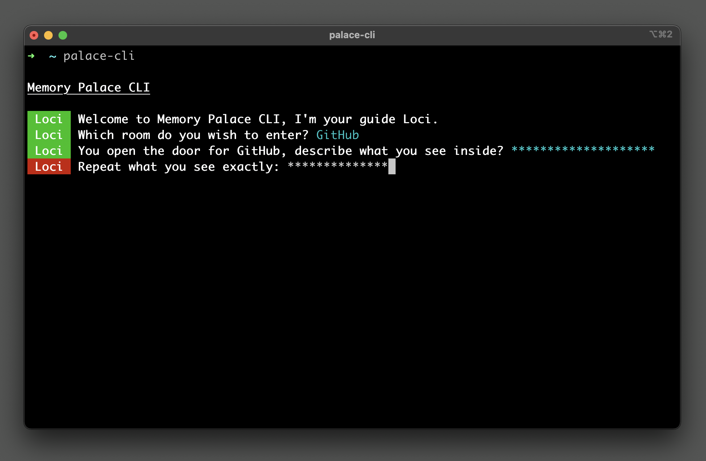
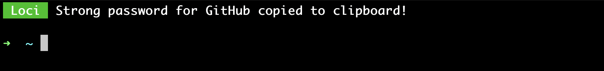

<div align="center">
  
</div>

<div align="center">
  <h1>Memory Palace CLI</h1>
  <p>A command line utility for generating and remembering complex passwords through<br />memory palace techniques and "choose your own adventure" style Q&A prompts</p>
</div>

<br />

## Installation

```
npm install -g palace-cli
```

_Note: You may need to run `sudo`._

<br />

## Instructions

Type `palace-cli` into your command line to start the Q&A flow.

<br />

<div align="center">
  
</div>

<br />
<br />

The combination of your answers will always yield the same output.

<br />

```
Which room do you wish to enter?
```

_For example: GitHub, Amazon, Twitter, some other service or thing_

<br />

```
You open the door for X, describe what you see inside?
```

_Create a passphrase like "a dog smoking a cigar" or "a horse wearing clogs"_

<br />

```
ROOM          WHAT SEE YOU                 PASSWORD

Github        a dog smoking a cigar        F54c0350Df2cE%2b4a8f4%9a4+Cf4~7&8^b~6@e@97e61

Amazon        a horse wearing clogs        E22401D69c2~B#4a7bE!DeE$8&0&3+0a3&fdab4be4985

```

\_\_

<br />
<div align="center">
  
</div>

<br />
<br />

## Todo

• User defined custom places and characters/entities

• Choose your own adventure flow

<br />

## Philosophy & Goals

_The method of loci (loci being Latin for "places") is a strategy of memory enhancement which uses visualizations of familiar spatial environments in order to enhance the recall of information. The method of loci is also known as the memory journey, memory palace, or mind palace technique._

<sup>— Source Wikipedia: https://en.wikipedia.org/wiki/Method_of_loci</sup>
